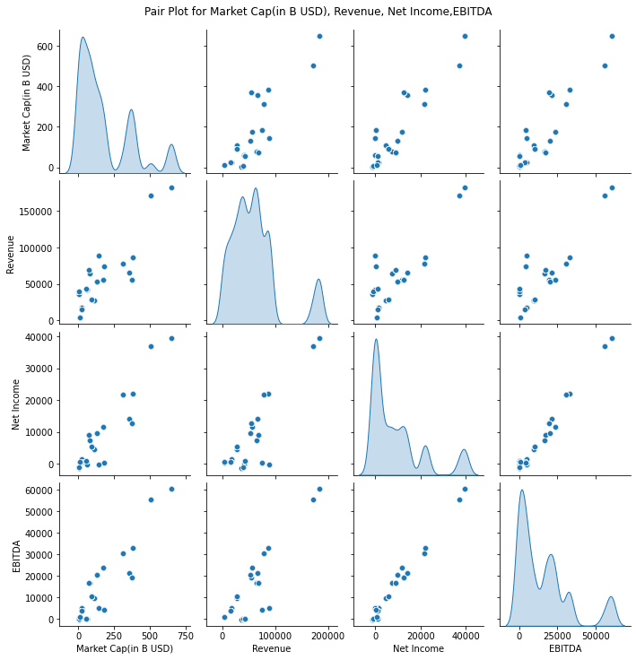
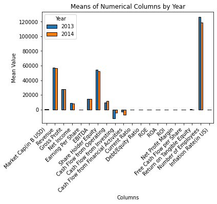
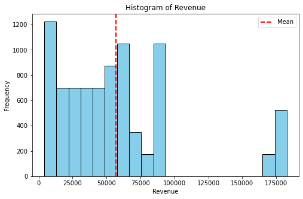

# Data Analysis Project README

## Introduction
Welcome to the README for the Financial Insights Data Analysis. This document serves as a guide to understand the structure, findings, and recommendations resulting from our data analysis.

## Table of Contents
1. [Data Overview](#data-overview)
2. [Analysis Methodology](#analysis-methodology)
3. [Results](#results)
4. [Conclusion](#conclusion)
5. [Recommendations](#recommendations)
6. [Visualizations](#visualizations)

## Data Overview
The datasets used in this project were acquired from kaggle.They are financial details of various companies, including market cap, revenue, gross profit, net income and other key financial metrics.

## Analysis Methodology
The data was imported and manipulated using the pandas, seaborn,matplotlib and numpy libraries. The two datasets were then combined based on the year. The enriched dataa was then analyzed numerically and graphically, producing histograms, box plots,pair plots, bar graphs, correlation heat map and a violin plot.

## Results
Cash flow from operating,Market Cap,Revenue, Gross profit, net income correlated positively.
The cash flow from investing and financial activities correlated most negatively with a lot of the other variables including market cap, gross revenue, revenue, net income, EBITDA and cash flow from operating.
A majority of the data had little correlation.

## Conclusion
The analysis highlights notable patterns in the dataset, revealing positive correlations among key financial indicators—Cash Flow from Operating, Market Cap, Revenue, Gross Profit, and Net Income. Conversely, Cash Flow from Investing and Financial Activities exhibit strong negative correlations with several variables, including Market Cap, Gross Revenue, Revenue, Net Income, EBITDA, and Cash Flow from Operating. It's noteworthy that a significant portion of the data shows limited correlation, emphasizing the diverse nature of financial metrics. These findings provide valuable insights into the interplay of financial variables, enabling a nuanced understanding of their relationships within the dataset.

## Recommendations
Enhance Cash Flow Management:

Given the positive correlation between Cash Flow from Operating and various financial metrics, focus on optimizing operational cash flow to positively impact Market Cap, Revenue, Gross Profit, and Net Income. Explore efficiency measures in day-to-day operations to bolster cash inflows.
Diversify Investment Strategies:

Address the pronounced negative correlations with Cash Flow from Investing and Financial Activities by diversifying investment strategies. Consider exploring alternative investment vehicles or reevaluating existing investment portfolios to mitigate potential risks.
Evaluate Financial Efficiency:

Given the varied correlation patterns, conduct a detailed evaluation of financial efficiency across different business segments or product lines. Identify areas with weaker correlations and assess opportunities for improvement or strategic realignment.
Risk Management for Financial Activities:

Given the negative correlations with Cash Flow from Investing and Financial Activities, implement robust risk management strategies. Monitor external factors influencing financial activities and establish contingency plans to navigate potential challenges.
Further Investigation into Low-Correlation Areas:

Explore factors contributing to areas with little correlation. Conduct in-depth analyses into variables with limited correlation to uncover hidden relationships or dependencies. This investigation can unveil potential growth opportunities or operational challenges not apparent in initial analyses.
Continuous Monitoring and Iterative Analysis:

Implement a system for continuous monitoring of financial metrics and correlations. Regularly revisit analyses and update models to account for evolving market dynamics, ensuring adaptability to changing business environments.
Cross-Functional Collaboration:

Foster collaboration between finance, operations, and investment teams to facilitate a holistic approach. Cross-functional insights can lead to more comprehensive strategies and informed decision-making.
External Benchmarking:

Compare the company's financial metrics and correlation patterns with industry benchmarks. This external perspective can provide valuable insights into areas of competitive advantage or potential weaknesses.
These recommendations aim to guide strategic decision-making, foster financial resilience, and ensure adaptability to dynamic market conditions. Continuous monitoring and a proactive approach to addressing correlations can contribute to sustained financial health and performance improvement.

## Visualizations

## Conclusion
Thank you for reviewing the README for the Financial Insights Data Analysis.

